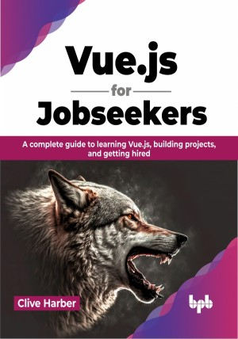

# Vue.js for Jobseekers

Learn how to build cross-platform applications with Vue.js

This is the repository for [Vue.js for Jobseekers
](https://bpbonline.com/products/vue-js-for-jobseekers?variant=42888578236616),published by BPB Publications.

## About the Book
Vue.js is a rapidly growing frontend framework with a large and active community. It is a great choice for developers who are looking for a modern, lightweight, and versatile framework to build web applications.

This book teaches you how to design and build client-side applications using Vue.js, a popular JavaScript framework. It starts with a solid foundation in the Vue framework, its core principles, and HTML and CSS. Then, it covers the latest Vue.js ecosystem, including Vue CLI, Pinia, Vue Router, and Composition API. Next, it shows you how to use server-side rendering with Nuxt.js, how to build a web interface, how to test your code, and how to integrate your application with a back end. Finally, it teaches you how to write good quality, maintainable code that adheres to industry standards and best practices.

By the end of this book, you will be a skilled Vue.js developer with the confidence to build high-quality, maintainable applications that meet the needs of your users.

## What You Will Learn
•  Get familiar with the different responsibilities of front-end developers, such as designing user interfaces, developing user interactions, and testing front-end applications.

•  Learn how to use Vue.js to build applications for different purposes and in different environments.

•  Explore the latest tools in the Vue.js ecosystem, such as Pinia, VueRouter, Quasar, and Nuxt.js.

•  Integrate Vue.js with different API types, CSS frameworks, and data models.

•  Learn how to answer common Vue.js interview questions and ace your next job interview.
